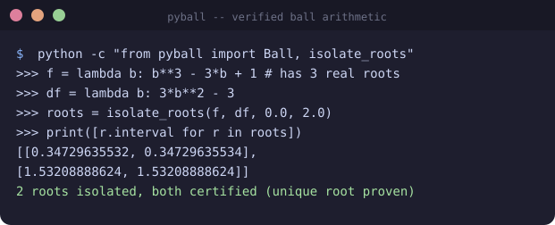

# pyball

[](https://github.com/kyoai-zhao/pyball/actions/workflows/ci.yml)
[](https://github.com/kyoai-zhao/pyball)
[](LICENSE)
[](https://pypi.org/project/pyball-arithmetic/)



Rigorous **ball / interval arithmetic** for Python: every value is an enclosure
`[mid ± rad]` that is guaranteed to contain the true real number — including
the rounding errors of the machine arithmetic used to compute it.

```python
>>> from pyball import Ball
>>> a = Ball(0.1, 1e-17)   # 0.1 ± 1e-17
>>> (a + 0.2).lo
0.30000000000000004
>>> (a + 0.2).hi
0.3000000000000001
```

`pyball` is deliberately **small and auditable** (a few hundred lines of pure
Python, no required runtime dependencies). It trades the aggressive tightness
of Arb-style Taylor / Richardson machinery for a sound, easy-to-review core
that runs anywhere CPython runs. It is the *midpoint-radius* (ball) form of
rigorous interval arithmetic in pure Python: Julia's `IntervalArithmetic.jl`
and C's Arb / MPFI provide this rigor, and Python has rigorous bindings
(`python-flint`), but no small, dependency-free, pure-Python ball library with
documented directed-rounding guarantees.

## Rigor model

A `Ball` has a midpoint `m` and radius `r >= 0`; the enclosure is `[m−r, m+r]`.

* **Exact fast path.** The midpoint may be an exact rational
  (`int` / `fractions.Fraction`). When both operands are exact and the radius
  is `0.0`, arithmetic (`+ − × ÷` and integer powers) runs in exact rational
  arithmetic with no rounding at all.
* **Directed rounding.** When floats are involved, every endpoint is pushed
  outward with `math.nextafter` (round-toward-±∞), so the enclosure can never
  shrink due to rounding.
* **Error bounds.**
  - Basic operations (`+ − × ÷ √`) use IEEE-754 **correct rounding**, which
    Python's `float` guarantees; their error is bounded by `0.5 ulp`.
  - Transcendental functions (`exp log sin cos tan atan sinh cosh`, and
    `x ** y` through `exp(y·log x)`) use a **Lipschitz bound over the whole
    input ball**: `f(m±r) ⊆ f(m) + [−1, 1]·(L·r + err)`. Their evaluation
    error is bounded by **1 ulp**, the accuracy the C standard and
    IEEE-754-2019 *recommend* for libm.

  > **Platform assumption (documented, not verified in code):** `math`
  > transcendentals are assumed accurate to 1 ulp, which is true on every
  > mainstream IEEE-754 platform (glibc, macOS, Windows, CPython uses the
  > platform libm). Basic operations carry the stronger, *guaranteed* 0.5 ulp
  > bound.

Because errors are covered by the enclosures themselves, the library is **not
sensitive to the platform's transcendental rounding** — only the enclosure
*width* (tightness) varies, never its soundness.

## Installation

```bash
pip install pyball-arithmetic        # pure Python, zero required dependencies
pip install "pyball-arithmetic[numpy]"  # optional: vectorized BallArray
pip install "pyball-arithmetic[dev]"    # optional: test runner
```

Requires Python ≥ 3.10.

## Usage

```python
from pyball import Ball
from fractions import Fraction

# exact rational arithmetic — no rounding at all
Ball(Fraction(1, 3)) + Ball(Fraction(1, 3))   # exact 2/3, rad == 0

# floats: sound enclosures, always contain the true answer
x = Ball(1.0, 1e-6)
y = x.exp().log()
assert y.lo <= 1.0 <= y.hi

# interval semantics for comparisons / containment
assert Ball(1.0, 0.1) > Ball(0.0, 0.5)        # whole enclosures are ordered
assert Ball(2.0, 0.0) in Ball(0.0, 3.0)
```

### Certified root isolation (`pyball.isolate_roots`)

The interval-Newton layer finds *and proves* the zeros of a differentiable
function on a bounded domain, using only enclosure arithmetic:

```python
from pyball import Ball, isolate_roots

f = lambda b: b**3 - 3 * b        # roots at -sqrt(3), 0, +sqrt(3)
df = lambda b: 3 * b**2 - 3
roots = isolate_roots(f, df, -3.0, 3.0)
for r in roots:
    assert r.certified                     # a proven unique root, not a guess
    assert r.interval.lo <= True_root <= r.interval.hi
```

Each returned `RootCert` carries an enclosure and a `certified` flag:
`certified=True` is an *interval-Newton proof* of a unique zero inside the
enclosure (walks are bisection + `N(X) = mid − f(mid)/f'(X)`); intervals that
cannot be settled within the split budget come back as unproven candidates
(`certified=False`). pyball never certifies a root it cannot prove.

### Certified evaluation (`pyball.certify_claim` / `prove_positive_negative`)

`verify.py` turns enclosures into *provable sign certificates* by bisection:

```python
from pyball import certify_claim

f = lambda b: b**2 - 2          # an exact-to-float expression
certify_claim(f, 2.0, 3.0, ">0")  # -> enclosure; f provably > 0 on [2,3]
certify_claim(f, 0.0, 1.0, ">0")  # -> None; not provable (it is negative)
```

### Vectorized (`pyball.BallArray`, requires NumPy)

```python
import numpy as np
from pyball import BallArray

x = BallArray(np.array([1.0, 2.0]), np.array([0.1, 0.1]))
s = x + x
s.contains(np.array([2.0, 4.0]))   # -> [True, True]
```

## Why not …?

| Existing tool | Language | What it gives you | Gap it leaves |
| --- | --- | --- | --- |
| `python-flint` (Arb/FLINT binding) | C ext | arbitrary-precision, extremely tight ball arithmetic | a compiled binding to a huge library; heavy install; not auditable line-by-line |
| `IntervalArithmetic.jl` | Julia | mature rigorous interval/ball arithmetic | not Python |
| Arb / MPFI | C | rigorous ball / endpoint arithmetic | requires a C toolchain and a separate build step |
| `mpmath.iv` | Python | arbitrary precision with interval ops | slow, wraps-only convenience; no midpoint-radius design or documented per-op rounding chain |
| `pyinterval` | Python | endpoint interval arithmetic (BSD-3) | last release 2017; leans on CRlibm compiled deps for rigor; endpoint–not ball–representation; no exact-rational fast path |
| `python-intervals` | Python | interval sets over comparable objects | combinatorics / date ranges – not floating-point rigor |
| `pydecimal` interval tricks | Python | decimal ≠ binary enclosures | no transcendental enclosure, no ulp-level bounds |

`pyball` gives you a soundness guarantee comparable to Arb's basic `arb_t`
ops — rigorous enclosures with an explicit, documented rounding-error chain
(`0.5 ulp` for correctly-rounded basic ops, `1 ulp` Lipschitz bounds for
transcendentals) — in a dependency-free, MIT-licensed, line-auditable pure
Python package.

## Roadmap

- [x] `certify` layer: interval Newton for certified root isolation (C4 fold-in)
- [ ] tighter elementary-function enclosures (argument reduction for `sin/cos`,
      Hankel/Richardson-like error control)
- [ ] `BallArray` fast paths for transcendental ufuncs (currently scalar fallback)
- [ ] `log_gamma`, `expm1`, `log1p`, `atan2` and other elementary functions
- [ ] CI matrix on 3.10–3.13 incl. the mpmath oracle tests

## Development

```bash
python -m unittest discover -s tests -v   # stdlib-only run
pip install -e ".[dev]"                   # full dev deps (pytest, mpmath, numpy)
pytest
```

## License

MIT — see [LICENSE](LICENSE).
